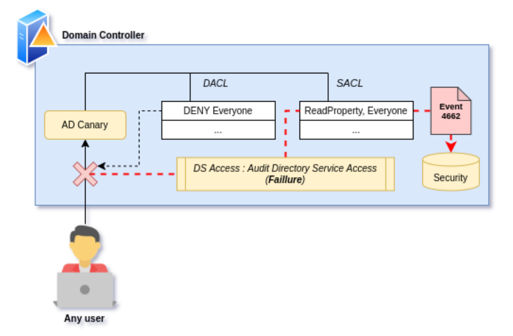
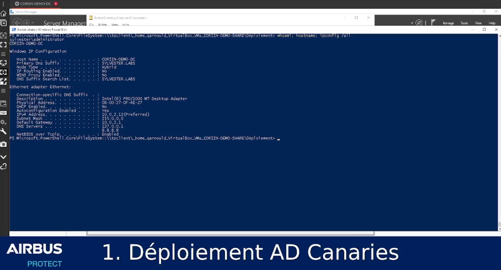
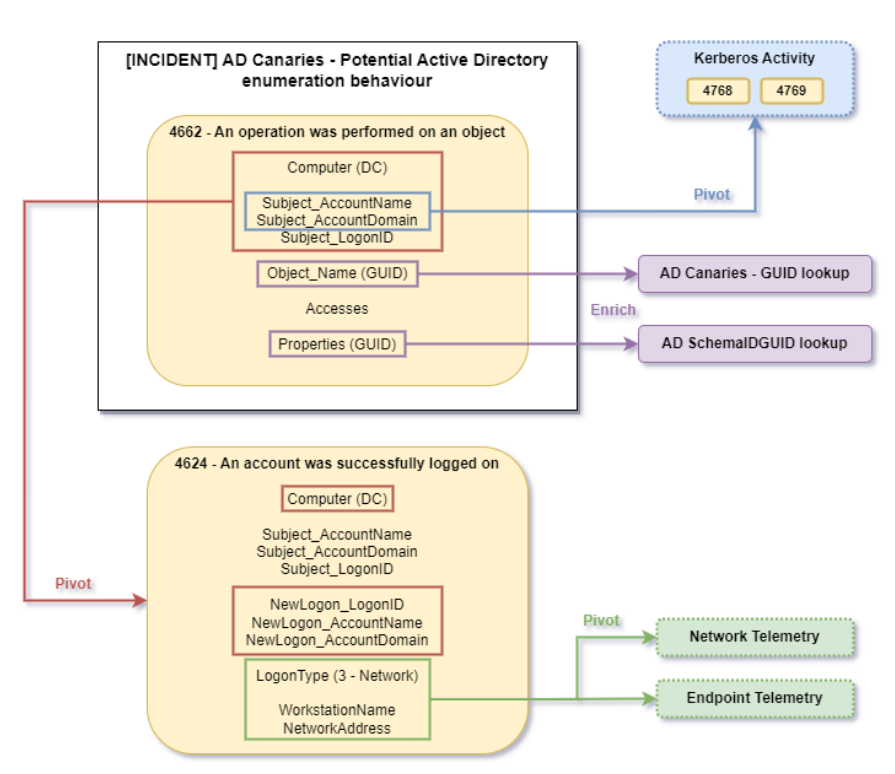

# Active Directory Canaries

<figure>
    
</figure>

---


## Description

Active Directory Canaries is a detection primitive for Active Directory enumeration (or recon) techniques. It abuses the concept of DACL Backdoors, introduced by Specter Ops researchers Andy Robins (@_wald0) and Will Schroeder (@harmj0y) back in 2017 in their white paper ["An ACE Up the Sleeve"](https://www.blackhat.com/docs/us-17/wednesday/us-17-Robbins-An-ACE-Up-The-Sleeve-Designing-Active-Directory-DACL-Backdoors.pdf).

The purpose of this project is to publish and maintain the deployment PowerShell script that automates required AD object deployments.

### Resources

 - 3 part blogpost (*quite long*) in english :

    - [Part 1 : about detecting AD enumeration](https://www.protect.airbus.com/blog/active-directory-a-canary-under-your-hat/)
    - [Part 2 : AD Canaries & DACL backdoors](https://www.protect.airbus.com/blog/active-directory-a-canary-under-your-hat-part-2/)
    - [Part 3 : Making it useable – improvements and in-production deployment results](https://www.protect.airbus.com/blog/active-directory-a-canary-under-your-hat-part-3/)

 - [Slides in french presented at CORIIN 2023](.resources/slides/FRENCH-CORIIN2023-AD%20Canaries.pdf)

## Warning

AD Canaries deployment requires AD admin permission, and involves deploying several new AD objects to production. Although these objects are isolated and hardened, we strongly invite you to review the code before and test it **before** any in-production deployment.

## Detection mechanism

AD Canaries detection is based on `Directory Service Object Access : Failure` audit which generates a 4662 event in the Security eventlog on your domain controller upon AD enumeration behaviours (i.e access attempt on any canary object).

<figure>
    
</figure>


## Deployment steps

**IMPORTANT**: AD Canaries deployment requires AD Admin privileges

``` powershell
Usage : ./ADCanaries.ps1  -Populate -Config <Path> -ParentOU <OU> \
                                                   -Owner <Principal|Group Name> \
                                                   -CanaryContainer <Name>          : 'Populate default ADCanaries deployment; overwrites json config file provided.'
                          -Deploy -Config <Path> -Output <Path>                     : 'Deploy ADCanaries using json configuration file and outputs lookup CSV with CanaryName,CanaryGUID'
                          -Revert -Config <Path>                                    : 'Destroy ADCanaries using json configuration file'
                          -AuditSACLs                                               : 'Display the list of existing AD objects with (ReadProperty|GenericAll) audit enabled to help measure DS Access audit failure activation impact'
                          -GetObjectPropertiesGuids -Output <Path>                  : 'Retreives the schemaIDGuid for attributes of Canaries objectClass and outputs as csv'
```

Deployment demonstration video example presented at CORIIN 2023 :
[](.resources/videos/ADCanaries-DEMO-CORIIN.mp4)

### Optional : Auditing existing SACLs within the environment

``` powershell
./ADCanaries.ps1 -AuditSACLs
```

### Populating the JSON file

#### Requirements

- Choosing or creating an OU to deploy ADCanaries within:
    - AD canaries will create all objects required to have a hardened isolated bundle of objects, but you need to choose where (i.e. **which OU**) to deploy inside the AD tree.
- Choosing a group of users that will own canary objects. 
    - This group of users will be the only (along with AD Admins) to be able to alter the deployed canaries. We recommend to setup **DOMAIN\Administrators as Owner**.

In the following example, we chose to deploy inside the OU 'OU=CORIIN-DEMO,DC=SYLVESTER,DC=LABS' and configure 'Domain Admins' as owner :

``` powershell
./ADCanaries.ps1 -Populate -Config ADCanaries.json -ParentOU 'OU=CORIIN-DEMO,DC=SYLVESTER,DC=LABS' -Owner 'Domain Admins' -CanaryContainer 'GrosMinet'
```

Specify the pre-existing ParentOU in which you want to deploy the canaries, and the deployed OU name.
**Try to make these blend as much as possible in your environment as those are the only objects that will be visible after full deployment.**

Populate will generate a JSON config file that you can customize to your liking ahead of deployment: 
``` bash
{
    “Configuration”: {
        “CanaryOwner”:  “Domain Admins”,
        “CanaryGroup”: {
            “OtherAttributes”: {},
            “Description”:  “[ADCanaries] Canaries primary group -- [VISIBLE TO ATTACKERS] change it”,
            “Type”:  “group”,
                        “ProtectedFromAccidentalDeletion”:  1,
                        “Name”:  “TEST”,
                        “Path”:  “CN=TEST,OU=TEST,DC=CYBERLAB,DC=NET”

        },
        “CanaryContainer”: {
            “OtherAttributes”: {},
            “Description”:  “[ADCanaries] Default container -- [VISIBLE TO ATTACKERS] change it”,
                        “Type”:  “container”,
                        “ProtectedFromAccidentalDeletion”:  1,
                        “Name”:  “TEST”,
                        “Path”:  “OU=TEST,DC=CYBERLAB,DC=NET”

        }
    },
    “Canaries”: [
    {   “OtherAttributes”: {},
        “Description”:  “[ADCanaries] Default User Canary -- change it”,
        “Type”:  “user”,
        “ProtectedFromAccidentalDeletion”:  1,
        “Name”:  “CanaryUser”,
        “Path”:  “CN=TEST,OU=TEST,DC=CYBERLAB,DC=NET”

    },{ “OtherAttributes”: {},
        “Description”:  “[ADCanaries] Default Computer Canary -- change it”,
        “Type”:  “computer”,
        “ProtectedFromAccidentalDeletion”:  1,
        “Name”:  “CanaryComputer”,
        “Path”:  “CN=TEST,OU=TEST,DC=CYBERLAB,DC=NET”
    },{ “OtherAttributes”: {},
        “Description”:  “[ADCanaries] Default Group Canary -- change it”,
        “Type”:  “group”,
        “ProtectedFromAccidentalDeletion”:  1,
        “Name”:  “CanaryGroup”,
        “Path”:  “CN=TEST,OU=TEST,DC=CYBERLAB,DC=NET”
    },{ “OtherAttributes”: {},
        “Description”:  “[ADCanaries] Default CertificateTemplate Canary -- change it”,
        “Type”:  pKICertificateTemplate,
        “ProtectedFromAccidentalDeletion”:  1,
        “Name”:  “CanaryCertTemplate”,
        “Path”:  “CN=TEST,OU=TEST,DC=CYBERLAB,DC=NET”
    },
    ...
    ]
}
```

**NB:** AD canaries are deployed as AD objects, you can configure other type of canaries by specifying existing AD Objects type such as :
- domainPolicy
- pKICertificateTemplate
- organizationalUnit
- ...

To uncover enumeration of this types of objects within your domains.

**/!\\** you might need some troubleshouting when implementing non standard canary objects **/!\\**

### Deploying based on the JSON file

Will deploy all AD objects, disable inheritance, change owner and default primary group, configure SACLs and remove all permissions with an explicit DENY on Everyone :

``` powershell
./ADCanaries.ps1 -Deploy -Config ADCanaries.json -Output CanaryGuids.csv
```

**IMPORTANT**: Backup the JSON config file as it will be required to delete the deployed objects using -Revert option !

Now if you have properly configured auditing, you should be able to test 4662 (DS Access failure)event generation upon AD enumeration.
Example of detection query in KQL (with pivot on 4624 logon event to enrich) :

``` sql
SecurityEvent
| where EventID == 4662 and ObjectServer == “DS”
| extend Object = tostring(split(split(ObjectName, “{“)[1], “}”)[0]),
         AccessedProperties = extract_all(@”\{([a-fA-F\d]{8}-[a-fA-F\d]{4}-[a-fA-F\d]{4}-[a-fA-F\d]{4}-[a-fA-F\d]{12})\}”, Properties)
// ADCanaries.csv generated when deploying via the aforementioned script
| lookup kind=inner _GetWatchlist(“ADCanaries”) on $left.Object==$right.SearchKey
| mv-expand AccessedProperties
| extend Prop = tostring(AccessedProperties)
// PropertiesGUIDs.csv generated when deploying via the aforementioned script
| lookup kind=leftouter _GetWatchlist(“PropertiesGUIDs”) on $left.Prop==$right.SearchKey
// Simple DIY lookup table using MS documentation for event 4662
| lookup kind=leftouter _GetWatchlist(“AccessTypes”) on $left.AccessMask==$right.SearchKey
| join kind = leftouter (
    SecurityEvent
    | where EventID == 4624 and LogonType == 3
) on $left.Computer==$right.Computer and $left.SubjectLogonId==$right.TargetLogonId and $left.SubjectUserName==$right.TargetUserName
// Some aggregation here, not optimal 
| summarize Count=count(), AccessedProps=makeset(ldapDisplayName), LogonIds=makeset(SubjectLogonId), Accesses=makeset(Access), IPs=makeset(IpAddress1), Devices=makeset(WorkstationName1)
by bin(TimeGenerated, 1m), SubjectUserName, SubjectDomainName, CanaryName
// Don’t forget to add fine tuned exclusions on normal behavior here 
```

### Optional : Creating a CSV lookup for AccessedProperties GUIDs

We relyed a lot on the specific set of AccessedProperties to identify and exclude on legitimate AD enumeration within a production environment.

These properties are present in the generated 4662 event, but with only a GUID.
You can use the '-GetObjectPropertiesGuids' option to create a non-exhaustive CSV lookup of object properties within your environment and associated GUIDs:

``` powershell
./ADCanaries.ps1 -GetObjectPropertiesGuids -Output AccessPropertiesGuids.csv
```

### Deleting everything based on the JSON file

``` powershell
./ADCanaries.ps1 -Revert -Config ADCanaries.json
```

You can also remove manually the deployed objects; from a domain admin session using AD Users & Computers console :
1. change the owner of the hidden OU to yourself 
2. remove the explicit deny from the OU
3. Inside the OU for each object do the exact same : change owner + remove explicit deny
4. Delete canary objects 
5. Delete canary primary group
6. Delete canary OU

## Investigation workflow


    - Who initiated this enumeration ?
        - Source event 4662

    - What was enumerated ?
        - Enrichment from source event

    - From where was this initiated ?
        - Pivot: Logon event 4624 

    - What is the behavior behind this enumeration ?
        - Pivot: Identified asset’s telemetry
            - Process executions
            - File creations
            - Network connections
            - RPC calls
            - …

    - Do I see any other “classic” attack patterns ?
        - Pivot: Identified account Kerberos activity
        - Pivot: Network telemetry

 

<figure>
    
</figure>
